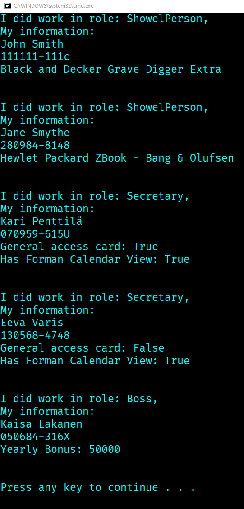

<!-- PROJECT SHIELDS -->
<!--
*** I'm using markdown "reference style" links for readability.
*** Reference links are enclosed in brackets [ ] instead of parentheses ( ).
*** See the bottom of this document for the declaration of the reference variables
*** for contributors-url, forks-url, etc. This is an optional, concise syntax you may use.
*** https://www.markdownguide.org/basic-syntax/#reference-style-links
-->
[![LinkedIn][linkedin-shield]][linkedin-url]


  <h1 align="center">Aktia Task 01</h1>
  <h2 aligh="center">C# / .NET Framework</h2>


<!-- TABLE OF CONTENTS -->
<details open="open">
  <summary>Table of Contents</summary>
  <ol>
    <li>
      <a href="#about-the-project">About The Project</a>
      <ul>
        <li><a href="#built-with">Built With</a></li>
      </ul>
    </li>
    <li>
      <a href="#getting-started">Getting Started</a>
      <ul>
        <li><a href="#prerequisites">Prerequisites</a></li>
        <li><a href="#installation">Installation</a></li>
      </ul>
    </li>
   </ol>
</details>


<!-- ABOUT THE PROJECT -->
## About The Project


This is a small console app made in C#, .NET Framework [4.7.2].
</br>
This is about class creation and JSON deserialization.





### Built With

* [C#](https://docs.microsoft.com/en-us/dotnet/csharp/)
* [.NET Framework](https://dotnet.microsoft.com/download/dotnet-framework/net472)
* [Json.NET](https://www.newtonsoft.com/json)
* [Visual Studio](https://visualstudio.microsoft.com/)


<!-- GETTING STARTED -->
## Getting Started


### Prerequisites

* .NET Framework
  ```sh
  https://dotnet.microsoft.com/download/dotnet-framework/net472
  ```
* Visual Studio
  ```sh
  https://visualstudio.microsoft.com/
  ```

  
  
  
  

### Installation

1. Clone the repo
   ```sh
   git clone https://github.com/BeeBeeCue/Aktia_Csharp
   ```
2. Open in Visual Studio
3. Run without debugger
   ```sh
   Ctrl + F5
   ```
 
   


<!-- MARKDOWN LINKS & IMAGES -->
<!-- https://www.markdownguide.org/basic-syntax/#reference-style-links -->
[contributors-shield]: https://img.shields.io/github/contributors/othneildrew/Best-README-Template.svg?style=for-the-badge
[contributors-url]: https://github.com/othneildrew/Best-README-Template/graphs/contributors
[forks-shield]: https://img.shields.io/github/forks/othneildrew/Best-README-Template.svg?style=for-the-badge
[forks-url]: https://github.com/othneildrew/Best-README-Template/network/members
[stars-shield]: https://img.shields.io/github/stars/othneildrew/Best-README-Template.svg?style=for-the-badge
[stars-url]: https://github.com/othneildrew/Best-README-Template/stargazers
[issues-shield]: https://img.shields.io/github/issues/othneildrew/Best-README-Template.svg?style=for-the-badge
[issues-url]: https://github.com/othneildrew/Best-README-Template/issues
[license-shield]: https://img.shields.io/github/license/othneildrew/Best-README-Template.svg?style=for-the-badge
[license-url]: https://github.com/othneildrew/Best-README-Template/blob/master/LICENSE.txt
[linkedin-shield]: https://img.shields.io/badge/-LinkedIn-black.svg?style=for-the-badge&logo=linkedin&colorB=555
[linkedin-url]: https://www.linkedin.com/in/k-knutsen/
[product-screenshot]: images/screenshot.png
[class-screenshot]: images/diagram.png
